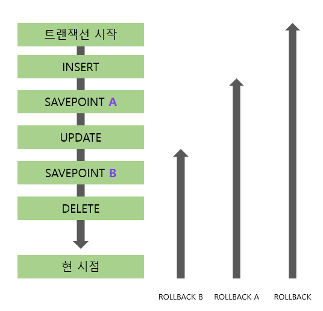

## [관리 구문]

### [제1절] DML

<details>
  
  #### ✔ DML (Data Manipulation Language)?
  
  : DML을 사용하면 테이블에 데이터를  입력, 수정, 삭제할 수 있다.

  > INSERT, UPDATE, DELETE, MERGE
 </br>

  #### ✔ INSERT

  INSERT 문을 통해 테이블에 데이터를 삽입할 수 있음

  1. **단일행 INSERT 문**

  ```SQL
  INSERT INTO 테이블명 [(칼럼1, 칼럼2, ...)] VALUES (값1, 값2, ...);
  ```

  - INTO 절의 칼럼명과 VALUES 절의 값을 **1:1 매핑하여 기술**
  - INTO 절에 기술하지 않은 칼럼은 Default로 NULL (단, NOT NULL 혹은 Primary Key 제약이 있다면 오류 발생)
  </br>

  ```SQL
  INSERT
    INTO PLAYER (PLAYER_ID, PLAYER_NAME, TEAM_ID, POSITION, HEIGHT, WEIGHT, BACK_NO)
  VALUES ('2002007', '박지성', 'K07', 'MF', 178, 73, 7);
  ```
  | PLAYER_ID | PLAYER_NAME | TEAM_ID | E_PLAYER_NAME | NICKNAME | JOIN_YYYY | POSITION | BACK_NO | NATION | BIRTH_DATE | SOLAR | HEIGHT | WEIGHT |
  |:---------:|:-----------:|:-------:|:-------------:|:--------:|:---------:|:--------:|:-------:|:------:|:----------:|:-----:|:------:|:------:|
  |  2002007  |    박지성   |   K07   |               |          |           |    MF    |    7    |        |            |       |   178  |   73   |
  </br>

  ```SQL
  INSERT
    INTO PLAYER -- INTO 절에 칼럼명을 지정하지 않는 경우, 테이블에 정의된 칼럼 순서대로 VALUES절에 모든 값을 기술해야함
  VALUES ('2002010', '이청용', 'K07', '', 'BlueDragon', '2002', 'MF', '17', NULL, NULL, '1', 180, 69);
  ```
  | PLAYER_ID | PLAYER_NAME | TEAM_ID | E_PLAYER_NAME |  NICKNAME  | JOIN_YYYY | POSITION | BACK_NO | NATION | BIRTH_DATE | SOLAR | HEIGHT | WEIGHT |
  |:---------:|:-----------:|:-------:|:-------------:|:----------:|:---------:|:--------:|:-------:|:------:|:----------:|:-----:|:------:|:------:|
  |  2002007  |    박지성   |   K07   |               |            |           |    MF    |    7    |        |            |       |   178  |   73   |
  |  2002010  |    이청용   |   K07   |               | BlueDragon |    2002   |    MF    |    17   |        |            |   1   |   180  |   69   |
  </br>


  2. **서브 쿼리를 이요한 다중 행 INSERT 문**

  ```SQL
  INSERT INTO 테이블명[(칼럼1, 칼럼2, ...)] 
  서브쿼리;
  ```

  ```SQL
  INSERT
    INTO TEAM (TEAM_ID, REGION_NAME, TEAM_NAME, ORIG_YYYY, STADIUM_ID)
  SELECT REPLACE(TEAM_ID, 'K', 'A') AS TEAM_ID
       , REGION_NAME, REGION_NAME || '올스타' AS TEAM_NAME
       , 2019 AS ORIG_YYYY, STADIUM_ID
    FROM TEAM
   WHERE REGION_NAME IN ('성남', '인천'); 
  ```
  </br>

  #### ✔ UPDATE

  데이터를 수정해야하는 상황 발생 시, UPDATE 문을 통해 데이터를 수정

  ```SQL
  UPDATE 테이블명
    SET 수정할 칼럼명1 = 수정될 새로운 값1
     [, 수정할 칼럼명2 = 수정될 새로운 값2]
     [, ...]
  [WHERE 수정 대상 식별 조건식]
  ```

  - SET 절에는 수정할 칼럼명과 해당 칼럼에 수정될 값 기술
  - WHERE 절에는 수정대상이 될 행을 식별할 수 있도록 조건식 기술. (단, WHERE 절 사용안할 시 테이블의 전체 데이터가 수정됨)
  </br>

  ```SQL
  UPDATE PLAYER
    SET BACKNO = 99;
  -- WHERE 절이 없으므로, 일괄적으로 99로 수정


  UPDATE PLAYER
    SET POSITION = 'MF'
  WHERE POSITION IS NULL;


  -- 단일행 서브쿼리
  UPDATE TEAM A
    SET A.ADDRESS = (SELECT X.ADDRESS
                       FROM STATIUM X
                      WHERE X.HOMETEAM_ID = A.TEAM_ID)
  WHERE A.ORIG_YYYY > 2000;


  -- 다중 서브쿼리
  UPDATE STADIUM A
    SET (A.DDD, A.TEL) = (SELECT X.DDD, X.TEL -- 다중 칼럼 서브쿼리
                            FROM TEAM X
                           WHERE X.TEAM_ID = A.HOMETEAM_ID);
  WHERE EXISTS (SELECT 1 -- 다중행 서브쿼리, 연관 서브쿼리
                  FROM TEAM X
                WHERE X.TEAM_ID = A.HOMETEAM_ID);
  ``` 
  </br>

  #### ✔ DELETE

  테이블에 저장된 데이터가 더 이상 필요 없게 됐을 경우, DELETE 문을 통해 데이터 삭제 수행

  ```SQL
  DELETE [FROM] 테이블명
  [WHERE 삭제 대상 식별 조건식];
  ```

  - WHERE 절 사용 안할 시 테이블의 전체 데이터가 삭제됨.
  </br>

  ```SQL
  -- 전체 데이터 삭제
  DELETE FROM PLAYER;


  -- 다중행 서브쿼리
  DELETE PLAYER
  WHERE TEAM_ID IN (SELECT TEAM_ID
                      FROM PLAYER
                    GROUP BY TEAM_ID
                      HAVING COUNT(*) <= 10);
  ```
  </br>

  #### ✔ MERGE

  새로운 행을 입력하거나, 기존 행을 수정하는 작업을 한 번에 할 수 있음  

  ```SQL
  MERGE
   INTO 타겟 테이블명
  USING 소스 테이블명
     ON (조인 조건식)
   WHEN MATCHED THEN -- 조인에 성공한 행들
    UPDATE
      SET 수정할 칼럼명1 = 수정될 새로운 값1
        [,수정할 칼럼명2 = 수정될 새로운 값2, ...]
   WHEN NOT MATCHED THEN -- 조인에 실패한 행들
    INSERT [(칼럼1, 칼럼2, ...)]
    VALUES (값1, 값2, ...);
  ```

  ```SQL
  MERGE
    INTO TEAM T
   USING TEAM_TMP S
      ON (T.TEAM_ID = S.TEAM_ID)
    WHEN MATCHED THEN
      UPDATE
        SET T.REGION_NAME = S.REGION_NAME
          , T.TEAM_NAME = S.TEAM_NAME
          , T.DDD = S.DDD
          , T.TEL = S.TEL
    WHEN NOT MATCHED THEN
      INSERT (T.TEAM_ID, T.REGION_NAME, T.TEAM_NAME, T.STADIUM_ID, T.DDD, T.TEL)
      VALUES (S.TEAM_ID, S.REGION_NAME, S.TEAM_NAME, S.STADIUM_ID, S.DDD, S.TEL);


  -- USING 절에 서브쿼리 사용 예시
  MERGE
    INTO TEAM T
   USING (SELECT * FROM TEAM_TMP WHERE REGION_NAME IN('성남', '부산', '대구', '전주')) S
      ON (T.TEAM_ID = S.TEAM_ID)
    WHEN MATCHED THEN
      UPDATE
        SET T.REGION_NAME = S.REGION_NAME
          , T.TEAM_NAME = S.TEAM_NAME
          , T.DDD = S.DDD
          , T.TEL = S.TEL
    WHEN NOT MATCHED THEN
      INSERT (T.TEAM_ID, T.REGION_NAME, T.TEAM_NAME, T.STADIUM_ID, T.DDD, T.TEL)
      VALUES (S.TEAM_ID, S.REGION_NAME, S.TEAM_NAME, S.STADIUM_ID, S.DDD, S.TEL);
  ```
  </br>

  #### ✔ DDL VS DML?
  
  ```TEXT
  - DDL : 데이터 구조의 변경이 DDL 명령어 수행 완료후 즉시 반영
  
  - DML : 데이터 변경사항을 테이블에 영구적으로 변경하기 위해 COMMIT 필요
    (SQL Server는 AUTO COMMIT으로 즉시 반영됨)
  ```

</details>

---

### [제2절] TCL

<details>

#### ✔ TCL (Transaction Control Language)?

: TCL문을 사용하면 데이터베이스의 논리적 연산 단위인 트랜잭션을 제어할 수 있다.

> COMMIT, ROLLBACK, SAVEPOINT
</br>

#### ✔ 트랜잭션?

- 데이터베이스의 논리적 연산단위.
- 분할할 수 없는 최소의 단위이므로 `전부 적용하거나 전부 취소한다.`
 </br>

#### ✔ 트랜잭션 특징

1. **원자성** (`A`tomicity)

: 트랜잭션에서 정의된 연산들은 모두 성공적으로 실행되거나 전혀 실행되지 않은 상태로 남아 있어야함 (all or nothing)

2. **일관성** (`C`onsistency)

: 트랜잭션이 실행되기 전에 데이터베이스의 내용에 잘못이 없다면, 실행 후에도 데이터베이스의 내용에 잘못이 있으면 안 됨

3. **고립성** (`I`solation)

: 트랜잭션이 실행되는 도중에 다른 트랜잭션의 영향을 받아 잘못된 결과를 만들면 안됨

4. **지속성** (`D`urability)

: 트랜잭션이 성공적으로 수행된다면, 갱신된 데이터베이스의 내용은 영구적으로 저장되어야 함
</br>
</br>

#### ✔ COMMIT

: INSERT, UPDATE, DELETE 한 데이터에 대해 전혀 문제가 없다고 판단됐을 경우, COMMIT 명령어를 통해 트랜잭션 완료 가능.

```TEXT
[COMMIT 이나 ROLLBACK 이전의 데이터 상태]

- 데이터의 변경을 취소해 이전 상태로 복구 가능
- 현재 사용자는 SELECT 문장으로 결과 확인 가능
- 다른 사용자는 현재 사용자가 수행한 명령의 결과를 볼 수 없음
- 변경된 행은 잠금(LOCK)이 설정돼서 다른 사용자가 변경할 수 없음


[COMMIT 이나 ROLLBACK 이후의 데이터 상태]

- 데이터에 대한 변경 사항이 데이터베이스에 반영
- 이전 데이터는 영원히 잃어버림
- 모든 사용자는 결과를 볼 수 있음
- 관련된 행에 대한 잠금(LOCK)이 풀리고, 다른 사용자들이 행 조작 가능
```

```SQL
/*
ORACLE VER.
*/
INSERT
  INTO PLAYER (PLAYER_ID, TEAM_ID, PLAYER_NAME, POSITION, HEIGHT, WEIGHT, BACK_NO)
VALUES ('19970925', 'K02', '이운재', 'GK', 182, 82, 1);
-- 1개의 행이 만들어졌습니다.

COMMIT;
-- 커밋이 완료되었습니다.

UPDATE PLAYER SET HEIGHT = 100;
-- 100 행이 갱신됐습니다.

COMMIT;
-- 커밋이 완료되었습니다.

DELETE FROM PLAYER;
-- 481 행이 삭제됐습니다.

COMMIT;
-- 커밋이 완료됐습니다.

/*
SQL SERVER VER.
- 기본적으로 AUTO COMMIT 모드. 
- 성공시 COMMIT, 실패시 ROLLBACK
*/
INSERT
  INTO PLAYER (PLAYER_ID, TEAM_ID, PLAYER_NAME, POSITION, HEIGHT, WEIGHT, BACK_NO)
VALUES ('19970925', 'K02', '이운재', 'GK', 182, 82, 1);
-- 1개의 행이 영향을 받음

UPDATE PLAYER SET HEIGHT = 100;
-- 481개 행이 영향을 받음

DELETE FROM PLAYER; -- AUTO COMMIT
-- 481개 행이 영향을 받음
```
 </br>

#### ✔ ROLLBACK

: INSERT, UPDATE, DELETE 한 데이터에 대해 `COMMIT 이전`에는 변경 사항 취소 가능

```SQL
/*
ORACLE VER.
*/
INSERT
  INTO PLAYER (PLAYER_ID, TEAM_ID, PLAYER_NAME, POSITION, HEIGHT, WEIGHT, BACK_NO)
VALUES ('19970925', 'K02', '이운재', 'GK', 182, 82, 1);
-- 1개의 행이 만들어졌습니다.
ROLLBACK;
-- 롤백이 완료되었습니다.


UPDATE PLAYER SET HEIGHT = 100;
-- 100 행이 갱신됐습니다.
ROLLBACK;
-- 롤백이 완료되었습니다.


DELETE FROM PLAYER;
-- 481 행이 삭제됐습니다.
ROLLBACK;
-- 커밋이 완료됐습니다.


/*
SQL SERVER VER.
- 기본적으로 AUTO COMMIT 모드이므로, ROLLBACK을 수행하기 위해는 명시적으로 트랜잭션 선언해야함
*/
BEGIN TRAN

INSERT
  INTO PLAYER (PLAYER_ID, TEAM_ID, PLAYER_NAME, POSITION, HEIGHT, WEIGHT, BACK_NO)
VALUES ('19970925', 'K02', '이운재', 'GK', 182, 82, 1);
-- 1개의 행이 영향을 받음

ROLLBACK;
-- 명령이 완료되었습니다.
```
 </br>

#### ✔ SAVEPOINT

: 저장점을 정의하면 ROLLBACK 할 때 현 시점 ~ SAVEPOINT 까지 트랜잭션의 일부만 롤백 가능

```SQL
-- ORACLE VER.
SAVEPOINT SVPT1;
ROLLBACK TO SVPT1;


-- SQL SERVER VER.
SAVE TRANSACTION SVTR1;
ROLLBACK TRANSACTION SVTR1;
```



</details>

---

### [제3절] DDL

<details>

#### ✔ DDL (Data Definition Language)?

: DDL을 사용하면 테이블을 포함한 데이터베이스 객체의 구조를 정의할 수 있다. 

> CREATE TABLE, ALTER TABLE, DROP TABLE
 </br>

#### ✔ CREATE

```SQL
CREATE TABLE 테이블명 (
    칼럼명1   데이터유형  [기본값]  [NOT NULL]
  , 칼럼명2   데이터유형  [기본값]  [NOT NULL]
  , 칼럼명3   데이터유형  [기본값]  [NOT NULL]
);


-- CTAS (Create Table ~ As Select ~) 방법으로 테이블 생성.
-- ORACLE VER.
CREATE TABLE TEAM_TEMP AS SELECT * FROM TEAM;

-- SQL SERVER VER.
SELECT * INTO TEAM_TEMP FROM TEAM;
```

- 테이블명은 객체를 의미할 수 있는 적절한 이름 사용 + 중복 불가능
- 한 테이블 내에서는 칼럼명 중복 불가능 (다른 테이블의 칼럼 이름과는 같을 수 있음, 대체로 기본키와 외래키 관계)
- A-Z, a-z, 0-9, _, $, # 문자만 허용
 </br>

1. **제약조건?**

: 사용자가 원하는 조건의 데이터만 유지하기 위해 테이블의 특정 칼럼에 설정하는 제약
</br>`데이터의 무결성을 유지하기 위함`
</br>
</br>

2. **제약조건 종류**

  + **PRIMARY KEY (기본키)**
  </br>: 테이블에 저장된 행 데이터를 고유하게 식별하기 위한 기본키 정의

  > 기본키 제약 = NOT NULL & UNIQUE
  </br>

  + **UNIQUE (고유키)**
  </br>: 테이블에 저장된 행 데이터를 고유하게 식별하기 위한 고유키 정의. *NULL은 고유키 제약 대상 아님. NULL 가능*
  </br>
  
  + **NOT NULL**
  </br>: NULL 값 입력 금지.

  > NULL의 의미 = '아직 정의되지 않은 값' 혹은 '아직 데이터가 입력되지 않은 경우'로 공백, 숫자와는 전혀 다른 값이다.
  </br>

  + **CHECK**
  </br>: 입력할 수 있는 값의 범위 제한. TRUE or FALSE로 평가가능한 논리식 지정
  
  `CREATE TABLE TEAMP_TEMP (SAL NUMBER(7,2) CHECK(SAL BETWEEN 500 AND 5000))`

  `CREATE TABLE TEAMP_TEMP (GENDER VARCHAR2(1) CHECK(GENDER IN('M','F')))`
  </br>

  + **FOREIGN KEY (외래키)**
  </br>: 관계형 데이터베이스에서 테이블 간의 관계를 정의하기 위해 기본키를 다른 테이블의 외래키로 복사하는 경우 생성됨. 

  > 외래키 지정시, 참조 무결성 제약 옵션 선택 가능
  </br>

3. **생성된 테이블 구조 확인**

```SQL
-- ORACLE VER.
DESCRIBE PLAYER;


-- SQL SERVER VER.
exec sp_help 'dbo.PLAYER'
go
```
</br>

#### ✔ ALTER TABLE

: 칼럼을 추가/삭제하거나 제약조건을 추가/삭제하는 작업

1. **ADD COLUMN**

: 기존 테이블에 필요한 칼럼을 추가하는 명령어
  
  ```SQL
  -- ORACLE VER.
  ALTER TABLE 테이블명
        ADD ( 추가할 칼럼명1    데이터 유형   [기본값]    [NOT NULL],
              [추가할 칼럼명2    데이터 유형   [기본값]    [NOT NULL]
              , ...]);
  ALTER TABLE PLAYER ADD (ADDRESS VARCHAR2(80));

  -- SQL SERVER VER.
  ALTER TABLE 테이블명
        ADD   추가할 칼럼명1    데이터유형    [기본값]    [NOT NULL]
           [, 추가할 칼럼명2    데이터유형    [기본값]    [NOT NULL]
           , ...];
  ALTER TABLE PLAYER ADD ADDRESS VARCHAR(80);
  ```
  </br>


2. **DROP COLUMN**

: 기존 테이블에 필요없는 칼럼을 삭제. 한 번 삭제된 칼럼은 복구할 수 없음
  
  ```SQL
  -- ORACLE VER.
  ALTER TABLE 테이블명 DROP (삭제할 칼럼명1 [, 삭제할 칼럼명2, ... ]);
  ALTER TABLE PLAYER DROP (ADDRESS);

  -- SQL SERVER VER.
  ALTER TABLE PLAYER DROP (ADDRESS);
  ALTER TABLE PLAYER DROP COLUMN ADDRESS;
  ```
  </br>

3. **MODIFY COLUMN**

: 테이블에 존재하는 칼럼에 대해 ALTER TABLE 명령을 이용해 칼럼의 데이터 유형, 디폴트 값, NOT NULL 제약조건에 대한 변경을 포함. (테이블의 칼럼 정의를 변경하는 명령어)
  
  ```SQL
  -- ORACLE VER.
  ALTER TABLE 테이블명
      MODIFY (칼럼명1    데이터유형    [기본값]    [NOT NULL]
           [, 칼럼명2    데이터유형    [기본값]    [NOT NULL]
            , ...]);
  ALTER TABLE TEAM_TEMP MODIFY (ORIG_YYYY VARCHAR(8) DEFAULT '20020129' NOT NULL);

  -- SQL SERVER VER.
  ALTER TABLE 테이블명 ALTER COLUMN   칼럼명  데이터 유형   [NOT NULL];
  ALTER TABLE TEAM_TEMP ALTER COLUMN ORIG_YYYY VARCHAR(8) NOT NULL;
  ALTER TABLE TEAM_TEMP ADD CONTRANT DF_ORIG_YYYY DEFAULT '20020129' FOR ORIG_YYYY;
  ```
  </br>

4. **RENAME COLUMN**

: 칼럼명을 어떤 이유로 불가피하게 변경해야하는 경우 (일부 DBMS에서만 지원)
  
  ```SQL
  -- ORACLE VER.
  -- ADD, DROP 처럼 ANSI/ISO에 명시된 기능이 아닌, Oracle 등 일부 DBMS에서만 지원함
  ALTER TABLE 테이블명 RENAME COLUMN 기존 칼럼명 TO 새로운 칼럼명;
  ALTER TABLE PLAYER COLUMN PLAYER_ID TO TEMP_ID;

  -- SQL SERVER VER.
  sp_rename '기존 칼럼명', '새로운 칼럼명', 'COLUMN';
  sp_rename 'dbo.PLAYER.PLAYER_ID', 'TEMP_ID', 'COLUMN';
  ```
  </br>

5. **DROP CONSTRAINT**

: 테이블 생성 시 부여했던 제약조건을 삭제하는 명령어
  
  ```SQL
  -- ORACLE, SQL SERVER 문법 동일
  ALTER TABLE 테이블명 DROP CONSTRAINT 제약조건명;


  ALTER TABLE PLAYER DROP CONSTRAINT PLAYER_FK;
  ```
  </br>

6. **ADD CONSTRAINT**
  
: 테이블 생성 이후에 필요에 의해 제약조건 추가하는 명령어
`참조 제약조건 추가시, 참조 무결성 옵션에 따라 실수에 의한 테이블 삭제나 데이터 삭제를 방지할 수 있음`

  ```SQL
  -- ORACLE, SQL SERVER 문법 동일
  ALTER TABLE 테이블명 ADD CONSTRAINT 제약조건명 제약조건 (칼럼명)
  
  
  ALTER TABLE PLAYER ADD CONSTRAINT PLAYER_FK FOREIGN KEY (TEAM_ID) REFERENCES TEAM(TEAM_ID);
  ```
 </br>

#### ✔ RENAME

: 테이블의 이름을 변경하는 명령어

```SQL
-- ORACLE VER.
RENAME 기존테이블명 TO 새로운 테이블명;

RENAME TEAM TO TEAM_BACKUP;


-- SQL SERVER VER.
sp_rename '기존테이블명', '새로운테이블명';

sp_rename 'dbo.team','TEAM_BACKUO';
```
</br>

#### ✔ DROP

: 불필요한 테이블을 삭제하는 명령어

```SQL
-- ORACLE, SQL SERVER 문법 동일
DROP TABLE 테이블명 [CASCADE CONTRAINT]; -- CASCADE CONTRAINT 옵션 : 해당 테이블과 관계가 있었던 참조되는 제약조건도 삭제함을 의미

DROP TABLE PLAYER;
```
</br>

#### ✔ TRUNCATE

: 테이블이 삭제되는것은 아니지만, 해당 테이블에 들어있던 모든 행 제거 및 공간을 재 사용하도록 하는 명령어

```SQL
-- ORACLE, SQL SERVER 문법 동일
TRUNCATE TABLE 테이블명;

TRUNCATE TABLE PLAYER;
```
</br>

#### ✔ DELETE vs TRUNCATE vs DROP

```BASH
- DELETE : 데이터 삭제 O / 테이블 삭제 X / 메모리 삭제 X / ROLLBACK O

- TRUNCATE : 데이터 삭제 O / 테이블 삭제 X / 메모리 삭제 O / ROLLBACK X

- DROP : 데이터 삭제 O / 테이블 삭제 O / 메모리 삭제 O / ROLLBACK X
```

</details>

---

### [제4절] DCL

<details>

#### ✔ DCL (Data Control Language)?

: DCL문을 사용하면 테이블을 사용하면 유저를 생성하거나 데이터베이스 권한을 제어할 수 있다.
</br>
</br>

#### ✔ 유저와 권한

대부분의 데이터베이스는 데이터 보호와 보안을 위해서 유저와권한을 관리하고 있다. Oracle을 설치하면 기본적으로 제공되는 유저는 다음과 같다.

- SCOTT : Oracle 테스트용 샘플 계정 (Default 패스워드 : TIGER)
- SYS : 백업 및 복구 등 데이터베이스 상의 모든 관리 기능을 수행할 수 있는 최상위 관리자 계정
- SYSTEM : 백업, 복구 등 일부 관리 기능을 제외한 모든 시스템 권한을 부여받은 DBA 계정
</br>

#### ✔ 유저 생성과 시스템 부여

사용자가 실행하는 모든 DDL 문장은 그에 해당하는 적절한 권한이 있어야만 실행할 수 있다. 그것을 `시스템권한` 이라고 하며, `ROLE`을 통해 권한을 부여한다.

```SQL
/* CREATE USER 권한 */
CONN SCOTT/TIGER;
CREATE USER SQLD IDENTIFIED BY DB2019;
-- 권한이 불충분합니다.

CONN SYSTEM/MANAGER;
GRANT CREATE USER TO SCOTT; -- SCOTT 계정에 계정 생성 권한 부여
-- 권한이 부여됐습니다.

CONN SCOTT/TIGER;
CREATE USER SQLD INDENTIFIED BY DB2019;
-- 사용자가 생성됐습니다.


/* CREATE SESSION (로그인) 권한 */
CONN SQLD/DB2019; -- SQLD 유저가 생성됐지만 아무런 권한이 없기 때문에 로그인 오류 발생
--  user SQLD lacks CREATE SESSION privilege

CONN SYSTEM/MANAGER;
GRANT CREATE SESSION TO SQLD; -- SQLD 계정에 로그인 권한 부여
-- 권한이 부여됐습니다.

CONN SQLD/DB2019;
-- 연결됐습니다.


/* CREATE TABLE 권한 */
CREATE TABLE MENU (MENU_SEQ NUMBER NOT NULL, TITILE VARCHAR2(10)); -- SQLD 에게는 테이블 생성권한이 없어 오류 발생
-- 권한이 불충분합니다.

CONN SYSTEM/MANAGER;
GRANT CREATE TABLE TO SQLD; -- SQLD 계정에 테이블 생성 권한 부여
-- 권한이 부여됐습니다.

CONN SQLD/DB2019;
CREATE TABLE MENU (MENU_SEQ NUMBER NOT NULL, TITILE VARCHAR2(10));
-- 테이블이 생성됐습니다.
```
 </br>

#### ✔ OBJECT에 대한 권한 부여

앞에서 SQLD 유저를 생성해 로그인하고 테이블을 만드는 과정에서 몇가지 권한을 살폈다면, 지금은 `특정 유저가 소유한 객체 권한`을 살펴본다.
</br>오프벡트 권한은 특정 오브젝트인 테이블, 뷰 등에 대해 SELECT, INSERT, DELETE, UPDATE 작업 명령어를 의미한다.

> 오브젝트 권한은 SELECT, INSERT, DELETE, UPDATE 등의 권한을 따로따로 관리하기 때문에 하나하나씩 권한을 부여해야함


```SQL
/*SELECT 권한*/
CONN SCOTT/TIGER;
SELECT * FROM SQLD.MENU; -- SCOTT은 SELECT 권한이 없어 오류 발생
-- 테이블 또는 뷰가 존재하지 않습니다.

CONN SQLD/DB2019;
GRANT SELECT ON MENU TO SCOTT; -- SCOTT에게 SELECT 권한 부여
-- 권한이 부여됐습니다.

CONN SCOTT/TIGER;
SELECT * FROM SQLD.MENU; -- 정상적으로 출력됨

UPDATE SQLD.MENU
   SET TITLE = '코리아'
 WHERE MENU_SEQ = 1; -- SCOTT은 현재 SELECT 권한만 있으므로 UPDATE 시 오류 발생, 하나하나씩 권한 부여 필요.
-- 권한이 불충분합니다.
```
</br>

#### ✔ ROLE을 이용한 권한 부여

데이터베이스 관리자가 유저가 생성될 때마다 각각의 권한들을 유저에게 부여하는 작업을 수행해야하는데, 하나하나씩 부여하다보면 권한을 빠뜨릴 수도 있으므로
유저별로 어떤 권한이 부여됐는지를 관리해야 한다.
</br> 또한 관리해야 할 유저가 점점 늘어나고 자주 변경되는 상황에서는 매우 번거롭다.
</br> 따라서... `ROLE을 생성하고 ROLE에 각종 권한을 부여한 후 ROLE을 다른 ROLE 혹은 유저에게 부여하여 관리한다`

```SQL
CONN SYSTEM/MANAGER;
REVOKE CREATE SESSION, CREATE TABLE FROM SQLD;
-- 권한이 취소됐습니다.

CONN SQLD/DB2019; -- SQLD 계정에 로그인 권한 없으므로 오류 발생
--  user SQLD lacks CREATE SESSION privilege

CONN SYSTEM/MANAGER;

CREATE ROLE LOGIN_TABLE;
GRANT CREATE SESSION, CREATE TABLE TO LOGIN_TABLE; -- [로그인권한]과 [테이블생성권한]이 부여된 ROLE 생성
-- 권한이 부여됐습니다.
GRANT LOGIN_TABLE TO SQLD; -- ROLE을 SQLD에게 부여함으로서 SQLD는 [로그인권한]과 [테이블생성권한]이 부여됨
-- 권한이 부여됐습니다.

CONN SQLD/DB2019;
CREATE TABLE MENU (MENU_SEQ NUMBER NOT NULL, TITILE VARCHAR2(10));
-- 테이블이 생성됐습니다.
```

</details>

---

### Reference
- SQL 전문가 가이드
